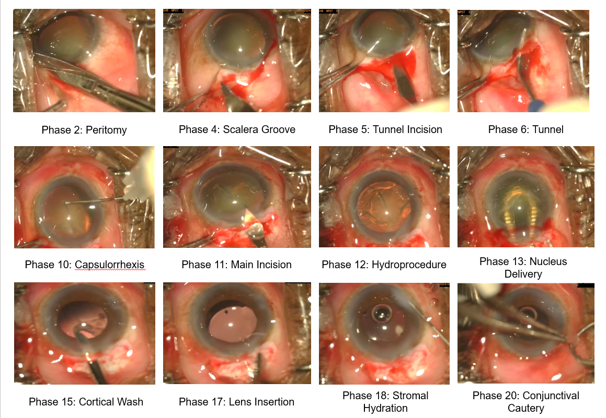

Welcome to the **Phase Recognition in Small Incision Cataract Surgery Videos (SICS-155)** challenge, a Satellite Event of the [MICCAI 2025 conference](https://conferences.miccai.org/2025/en/default.asp) in Daejeon, Republic of Korea! Here you can find some general information regarding our challenge, and later on download links for the data and source code show-casing the evaluation procedure. Please direct all questions regarding the challenge to our [Mail](mailto:ag.wintergerst@gmail.com).\
If you want to compete, first sign-up on the [Registration Page](registration.md), then you can download the datset on the [Dataset Page](dataset.md) and finally submit your docker container containig your submission on the [Submission Page](submission.md). You can find the corresonding timeline [here](index.md#challenge-timeline).

## News 
- 21.07. Release of aemporary file drop for docker container submissions (CodaBench links follow soon): [Submission](submission.md)
- 20.05. 
- 10.04. Training and validation datset were released: [Dataset Page](dataset.md)
- 01.04. Pre-rigistration opend: [Pre-Registration](https://forms.gle/g8WoBtbHuwnBBFKF9)

The challenge is sponsored by the the [Lamarr Institute for Machine Learning and Artificial Intelligence](https://lamarr-institute.org/), the Federal Ministry for Economic Cooperation and Development (BMZ), the Academic Hospital Partnership Program from the EKFS, and supported by the German Society for International Cooperation (GIZ).

  
  
  
  

## Challenge abstract

Cataract is the leading cause of blindness worldwide, most affecting life in low- and middle-income countries (LMICs). The mainly used, most appropriate, and most cost-effective cataract surgical technique for LMICs is small incision cataract surgery (SICS). While algorithms have been developed for automated video analysis of surgical performance parameters for the cataract surgical technique predominantly used in high-income settings, so far there were no datasets nor algorithms for SICS available [^1] [^2] [^3]. This MICCAI challenge introduces the first SICS video dataset and offers teams the opportunity to evaluate the effectiveness of their phase recognition algorithms. The dataset of 155 patients was recruited at Sankara Eye Hospital in India.

Analysis of surgical phases is important because it allows for quantitative comparison between different surgeons, feedback on identified critical steps, and detection of discrepancies from surgical protocols and because it is the first step for automatic assessment of surgical quality (Sim-OSSCAR) [^4]. Our contribution is the first public dataset for SICS holding surgical videos and phase annotations of 155 surgeries with 18 distinct phases.

Currently, there are other public cataract surgery phase datasets like Cataract-101 (n=101 videos) or the IEEE Cataracts (n=50 videos) but they only show phacoemulsification surgery which is distinct from SICS in the
following ways: SICS involves a larger 6-8 mm incision (2-3 mm for phaco), allowing for easier maneuvering of tools. The surgical phases in SICS are distinct, with steps such as Nucleus Delivery, Nucleus Prolapse, and
peritomy not performed in phacoemulsification, which instead includes Trenching, Nucleus Emulsification, and Irrigation/Aspiration [^5]. MSICS also utilizes specialized tools such as the Vectis, Dialer, Conjunctival Scissors,
Simcoe Cannula, Cautery, and Crescent Blade, which are not used in phaco; conversely, phacoemulsification surgery uses tools like Phaco Probe, Irrigation/Aspiration Probe, and Lens Injector [^6]. Still there is some overlap
between SICS and phacoemulsification and teams could consider using the mentioned datasets for transfer learning strategies.

Despite SICS widespread adoption in countries of the global south, no publicly available dataset exists for for this surgery, leaving a critical gap in cataract surgery research. Competitors are expected to submit an algorithm for predicting surgical phases based on the video data we supply and a short paper describing their approach.

The complete protocl can found here: [Protocol](https://zenodo.org/records/15087692).

We recently published a paper in Scientific Reports that establishs a performance baseline on a subset of the data used for this challenge (n=105). Find out more [here](https://doi-org.mu.idm.oclc.org/10.1038/s41598-025-00303-z).

## Dataset Overview

- **Name**: Small Incision Cataract Surgery Video Collection
- **Short name**: SICS-155
- **Size**: 155 videos
- **Splits**: 100 videos (train), 15 videos (validation), 40 videos (test)
- **Download**: [Link to dataset](dataset.md)
- **Details**: The 155 videos with a resolution of 960 x 540 pixels and a framerate of 30 FPS display small-incision cataract surgeries. Durations range from 5:01 to 21:58 minutes, and the average video length is 13:05 minutes. 
- **Ground truth**: The ground truth is provided in two formats, tabular and text files providing frame-by-frame phase annotations. In the the Excel file, start and end times of each observable phase in a video are defined.

## SICS Phases
The algorithm should target the prediction of surgical phases in the provided videos. For each frame in the
recordings, 1 of the 18 phases of SICS should be assigned by the algorithm. When no phase can be recognized in a
frame, a "background" phase can be assigned. A target frame rate of 15 frames per second (FPS) should be
achieved (lower than in the original videos to speed-up processing).
- peritomy: Conjunctiva is dissected to expose the sclera.
- cautery: Diathermy is applied to coagulate episcleral vessels.
- scleral_groove: A partial-thickness groove is made in the sclera.
- incision: The groove is extended to form a sclero-corneal tunnel.
- tunnel: A lamellar corneoscleral tunnel is dissected.
- sideport: A small incision for instrument access.
- AB_injection_and_wash: Balanced solution is injected to clear debris.
- OVD_injection: Viscoelastic is injected to maintain chamber stability.
- capsulorrhexis: A circular capsular opening is created.
- main_incision_entry: The tunnel is entered with a keratome.
- hydroprocedure: Fluid is injected to mobilize the nucleus.
- nucleus_prolapse: The nucleus is tilted into the anterior chamber.
- nucleus_delivery: The nucleus is removed via the scleral tunnel.
- cortical_wash: Residual cortex is aspirated.
- OVD_IOL_insertion: The intraocular lens is implanted into the capsular bag.
- OVD_wash: Remaining viscoelastic is removed.
- stromal_hydration: Incisions are hydrated for self-sealing.
- tunnel_suture: Bleeding is controlled with diathermy en suture.

## Challenge timeline

| Date     | Description                |
| :-------- | :-------------------------- |
| 01.04.2025 | (Pre)-Registration for the SICS-155 challenge opens. |
| 10.04.2025 | Estimated release of training data. | 
| 01.05.2025 | Estimated release of validation data. |
| 15.07.2025 | Opening of the submission system for algorithms. |
| 24.08.2025 | Submission for algorithms closes. |
| 22.08.2025 | Final deadline for submission of an short-paper associated with the submitted algorithm. |
| 31.08.2025 | Contacting the authors of top-ranked algorithms to prepare slides for oral presentation at MICCAI. |
| 01.09.2025 - 23.09.2025 | Final ranking of the results on unseen testing data. |

## Evaluation approach

For each submitted algorithm we will calculate the following metrics:
1. Accuracy (frame-wise)
2. Edit distance [also known as Levenshtein Distance] (phase-wise)
3. F1-score (frame-wise)
4. Precision-Recall area under curve (PR AUC)

Afterwards we will calculate a point-based significance ranking to establish the challenge winner, using the approach outlind in the recommed best practices by Maier-Hein et al [^7]. 

## Organizers

**Research team**:\
Bhuvan Sachdeva, Microsoft Research India\
Kaushik Murali, Sankara Eye Hospital Bangalore\
Mohit Jain, Microsoft Research India\
Simon Mueller, University Bonn, University Eye Clinic Bonn\
Singri Niharika Prasad, Sankara Eye Hospital Bangalore\
Thomas Schultz, University Bonn, Lamarr Institute for Machine Learning and Artificial Intelligence\
Yanwu Xu, South China University of Technology (Liaison OMIA Workshop)\
Maximilian Wintergerst, University Eye Clinic Bonn, Augenzentrum Grischun Chur (PI)

**Primary contact person**: Simon Mueller (PhD candidate) | University Hospital Bonn / Dept. of Ophthalmology

## References

[^1]: Müller S, Jain M, Sachdeva B, Shah PN, Holz FG, Finger RP, et al. Artificial Intelligence in Cataract Surgery: A Systematic Review. Translational Vision Science & Technology 13(4):20, 2024

[^2]: Tabin G, Chen M, Espandar L. Cataract surgery for the developing world. Curr Opin Ophthalmol. 19(1):55-9, 2008.

[^3]: Sommer, A., Taylor, H. R., Ravilla, T. D., West, S., Lietman, T. M., Keenan, J. D., Chiang, M. F., Robin, A. L., Mills, R. P., Society, f. t. C. o. t. A. O. Challenges of Ophthalmic Care in the Developing World. JAMA Ophthalmology 132:640-644, 2014.

[^4]: Dean, W. H., Murray, N. L., Buchan, J. C., Golnik, K., Kim, M. J., Burton, M. J. Ophthalmic Simulated Surgical Competency Assessment Rubric for manual small-incision cataract surgery. J Cataract Refract Surg 45:1252-1257, 2019.

[^5]: Martin Spencer. Phaco vs. small-incision. Ophthalmology, 113(2):353, 2006.

[^6]: Maria Grammatikopoulou, Evangello Flouty, Abdolrahim Kadkhodamohammadi, Gwenole Quellec, Andre Chow, Jean Nehme, Imanol Luengo, and Danail Stoyanov. Cadis: Cataract dataset for surgical RGB-image segmentation. Medical Image Analysis 71:102053, 2021

[^7]: Maier-Hein, L., Eisenmann, M., Reinke, A. et al. Why rankings of biomedical image analysis competitions should be interpreted with care. Nat Commun 9:5217, 2018.
