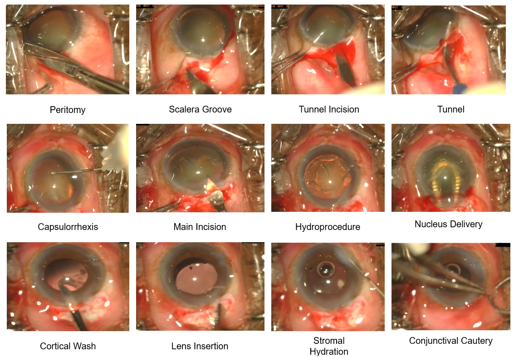

Welcome to the SICS-155 dataset webpage for the MICCAI 2025! Here you can find some general information regarding our challenge, and later on donwload links for the data and source code show-casing the evaluation procedure.

## Dataset Overview
- **Name**: Small Incision Cataract Surgery Video Collection
- **Short name**: SICS-155
- **Description**: A short description of the dataset.
- **Size**: 155 videos
- **Splits**: 100 videos (train), 15 videos (validation), 40 videos (test)
- **Download**: [Link to dataset]

## Challenge timeline

| Date     | Description                |
| :-------- | :-------------------------- |
| 01.04.2025 | (Pre)-Registration opens for Task 1 and challenge website opens. |
| 10.04.2025 | Estimated release of training data. | 
| 01.05.2025 | Estimated release of validation data. |
| 01.07.2025 | Opening of the submission system for algorithms. |
| 15.08.2025 | Submission for algorithms closes. |
| 22.08.2025 | Final deadline for submission of an short-paper associated with the submitted algorithm. |
| 31.08.2025 | Contacting the authors of top-ranked algorithms to prepare slides for oral presentation at MICCAI. |
| 01.09.2025 - 23.09.2025 | Final ranking of the results on unseen testing data. |

## Dataset Description
The data cotains 155 Color video recordings of the operating microscope with a resolution of 960 x 540 pixels and a framerate of 30 FPS displaying small-incision cataract surgeries. Surgery durations range from 5:01 to 21:58 minutes, and the average video length is 13:05 minutes. 

**Ground truth**: The groundTruth is provided in two formats, tabluar and text files providing frame-by-frame phase annotations. In the the excle file, start and end-times of each observable phase in a video are defined.

## SICS Phases
The algorithm should target the prediction of surgical phases in the provided videos. For each frame in the
recordings, 1 of the 18 phases of SICS should be assigned by the algorithm. When no phase can be recognized in a
frame, a "background" phase can be assigned. A target frame rate of 15 frames per second (FPS) should be
achieved (lower than in the original videos to speed-up processing).

- peritomy: Conjunctiva is dissected to expose the sclera.
- cautery: Diathermy is applied to coagulate episcleral vessels.
- scleral_groove: A partial-thickness groove is made in the sclera.
- incision: The groove is extended to form a sclero-corneal tunnel.
- tunnel: A lamellar corneoscleral tunnel is dissected.
- sideport: A small incision for instrument access.
- AB_injection_and_wash: Balanced solution is injected to clear debris.
- OVD_injection: Viscoelastic is injected to maintain chamber stability.
- capsulorrhexis: A circular capsular opening is created.
- main_incision_entry: The tunnel is entered with a keratome.
- hydroprocedure: Fluid is injected to mobilize the nucleus.
- nucleus_prolapse: The nucleus is tilted into the anterior chamber.
- nucleus_delivery: The nucleus is removed via the scleral tunnel.
- cortical_wash: Residual cortex is aspirated.
- OVD_IOL_insertion: The intraocular lens is implanted into the capsular bag.
- OVD_wash: Remaining viscoelastic is removed.
- stromal_hydration: Incisions are hydrated for self-sealing.
- conjunctival_cautery: Bleeding is controlled with diathermy.

## Evaluation approach

For each submitted algorithm we will calculate the following metrics:
- Accuracy (frame-wise)
- Edit distance [also known as Levenshtein Distance] (phase-wise)
- F1-score (frame-wise)
- Precision-Recall area under curve (PR AUC)

Afterwards well calculate a point-based significance ranking to establish the challenge winner, using the approach outlind in the recommed best practices by Maier-Hein et al [1]. 

## Organizers

**Research team**:
Bhuvan Sachdeva, Microsoft Research India\
Kaushik Murali, Sankara Eye Hospital Bangalore\
Simon Mueller, University Bonn, University Eye Clinic Bonn\
Singri Niharika Prasad, Sankara Eye Hospital Bangalore\
Thomas Schultz, University Bonn, Lamarr Institute for Machine Learning and Artificial Intelligence\
Yanwu Xu, South China University of Technology (Liaison OMIA Workshop)\
Maximilian Wintergerst, University Eye Clinic Bonn, Augenzentrum Grischun Chur (PI)

**Primary contact person**:
Simon Mueller
M.Sc., B.Med., PhD candidate
University Hospital Bonn | Dept. of Ophthalmology

## References

1. Maier-Hein, L., Eisenmann, M., Reinke, A. et al. Why rankings of biomedical image analysis competitions should
be interpreted with care. Nat Commun 9, 5217 (2018).
https://doi-org.mu.idm.oclc.org/10.1038/s41467-018-07619-7